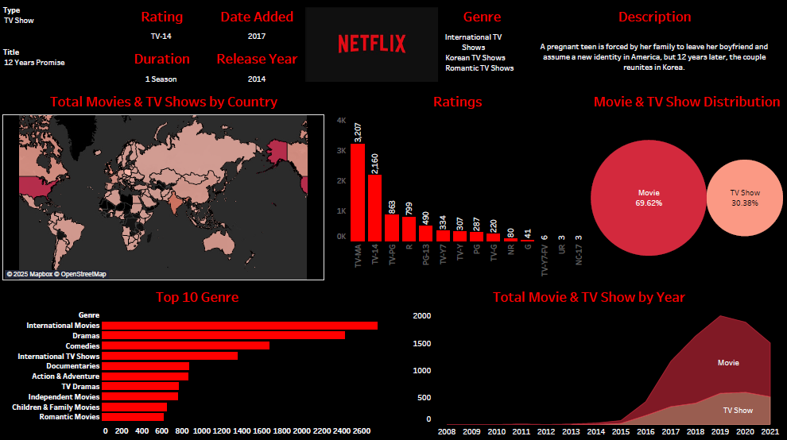

# Strategic Content Analytics on Netflix Dataset

This project demonstrates a full-stack data analytics pipeline using **Python**, **PostgreSQL (SQL)**, and **Tableau**, focused on deriving business-level insights from Netflix’s global content catalog. The analysis simulates how consulting firms like **Bain & Company**, **ZS Associates**, or **McKinsey** would explore data to inform content strategy, distribution decisions, and licensing timelines.

## 📌 Objective

To analyze Netflix’s catalog of movies and TV shows (~8,000+ titles after cleaning) and extract insights on:

- **Content format distribution** (Movies vs TV Shows)
- **Genre trends and preferences**
- **Top contributing countries**
- **Average movie durations**
- **TV show season patterns**
- **Content freshness (release year vs added year)**
- **Audience targeting via rating segmentation**
- And more.

## 🗂️ Dataset

Source: [Netflix Movies and TV Shows on Kaggle](https://www.kaggle.com/datasets/shivamb/netflix-shows)

- Original size: ~6,000 raw rows  
- Final cleaned and exploded dataset: **8,000+ records**  
- Data columns include: `title`, `type`, `director`, `cast`, `country`, `release_year`, `date_added`, `duration`, `rating`, `listed_in`, and more.

## 🛠️ Tech Stack

| Tool        | Purpose                          |
|-------------|----------------------------------|
| **Python (Pandas)** | Data cleaning, wrangling, and column transformations |
| **PostgreSQL (SQL)** | Writing complex queries for exploratory and business insights |
| **Tableau**          | Visualizing patterns and insights in an interactive dashboard |

## 📊 Dashboard

An interactive Tableau dashboard summarizes key business insights including:

- Country-wise content contribution
- Movie/TV Show share by year
- Genre popularity
- Director–Genre combinations
- Movie duration categories
- Age group distribution via content rating

📸 Preview:
  

## 📄 SQL Questions Solved

18+ business-relevant queries were implemented including:

- Top 10 contributing countries
- Most common genres
- Most prolific directors
- Duration category breakdown (Short, Medium, Long)
- Same-year release vs added analysis
- Genre vs format (TV Show/Movie) combinations
- Age group segmentation by rating
- and more.
